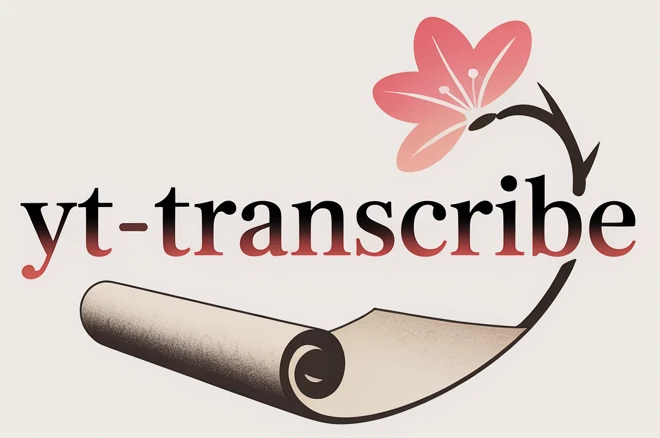
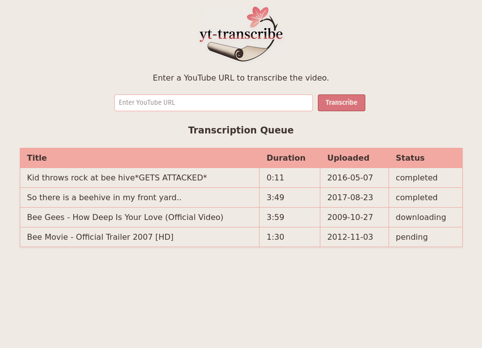

<p align="center">
    
    <p align="center">✍️ Transcribe YouTube videos using AI speech recognition </p>
</p>

## Requirements

* Go >= 1.24

## Features

* Transcribe YouTube audio using Whisper (via FFmpeg whisper filter)
* Summarize the transcription locally using phi3:mini via Ollama (no API key)
* Queue multiple video transcriptions
* Post-process audio with FFMPEG to speed up transcription to save token usage



## Usage

### Program usage

```bash
USAGE:
   yt-transcribe [global options] [command [command options]]

COMMANDS:
   version     Show current version
   transcribe  Transcribe a YouTube video
   runserver   Start HTTP server for YouTube transcription and queue management
   help, h     Shows a list of commands or help for one command

GLOBAL OPTIONS:
   --help, -h  show help
```

## License

`yt-transcribe` is under the terms of the [MIT License](https://www.tldrlegal.com/l/mit), following all clarifications stated in the [license file](LICENSE).

